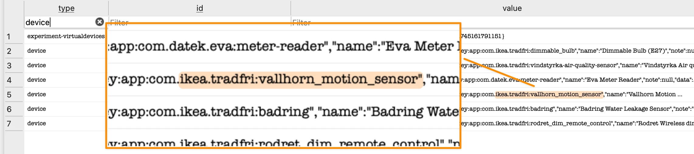

<a name="readme-top"></a>

<div align="center">
  <a href="https://github.com/oeeve/UC3BPR20">
    
  </a>
<br><br>
  <p align="center">
    <a href="#about"><strong>About</strong></a>
    ·
    <a href="#dataset"><strong>Dataset</strong></a>
    ·
    <a href="#testbed"><strong>Testbed</strong></a>
    ·
    <a href="#variables"><strong>Variables and Controls</strong></a>
    ·
    <a href="#artefacts"><strong>Artefacts</strong></a>
    ·
    <a href="#acquisition"><strong>Acquisition Process</strong></a>
  </p>
</div>


<!-- ABOUT -->
<a name="about"></a>
## UC3BPR20
Part of UC3BPR20 2025 - Acquisition and Analysis of Forensic Artefacts in a Smart Home Environment: A Study in IoT Forensics.

The following IoT / smart home forensics <a href="#dataset">dataset</a> are a result of a digital forensics experiment, based on a wireless smart home testbed consisting of an Atom Homey Pro smart home gateway and a set of Zigbee sensors and actuators, managed by the Homey Android application emulated on an Android Studio AVD. The resulting forensic artefacts (in the form of forensic images of the Homey Pro's eMMC storage, as well as logically extracted Android data, before and after execution of the experiment) has been made available in this <a href="#dataset">dataset</a>, which aims to support future research, training and testing in IoT forensics (also feel free to use it in CTF challenges).

As a reference point for future training and experiments, the <a href="#testbed">contents of the testbed</a>, the <a href="#variables">variables and controls</a>, the most significant <a href="#artefacts">artefacts</a>, as well as an outline of the  <a href="#acquisition">acquisition process</a> are detailed in the following sections.

A prototype tool, the [SlyFox IoT Sleuth (SFHPCBA01)](https://github.com/oeeve/SlyFox) has been developed as a forensic acquisition tool for Homey Pro (and other RPI CM4 based devices), based on the identified <a href="#acquisition">acquisition process</a> described below. 


<!-- DATASET -->
<a name="dataset"></a>
## Dataset

| Pre Experiment | SHA-256 |
| ----------- | -------------- |
| [](https://uc3bpr20.oddweb.io/artefacts/homey_pro_emmc/homey_pro_emmc_pre_experiment/HomeyProPre.E01) | `b924fe3259b3109939bee99eb3c28d10a20a8565dc0c3d7e157c55efdf80cfa7` |
| [](https://github.com/oeeve/UC3BPR20/raw/refs/heads/main/artefacts/homey_pro_avd_android_application/homey_pro_avd_android_application_pre_experiment.zip) | `fe17674f205c7b0279e7e5fd610c963215cc920e2e276186922f9550f03ddfb5` |

| Post Experiment | SHA-256 |
| ----------- | -------------- |
| [](https://uc3bpr20.oddweb.io/artefacts/homey_pro_emmc/homey_pro_emmc_post_experiment/HomeyProPost.E01) | `3239ba054101b7f1c75970183aa1f4b4320c51b83f7b804b2a7ad6dc0be05842` |
| [](https://github.com/oeeve/UC3BPR20/raw/refs/heads/main/artefacts/homey_pro_avd_android_application/homey_pro_avd_android_application_post_experiment.zip) | `4324b850c6c18393fad46c419323c62c84a9c5395e996862758340e78146031d` |


#### Suggested Use
The EnCase EWF (.E01) forensic images can be examined in any/most forensic tools. Free alternatives include [FTK Imager](https://www.exterro.com/ftk-product-downloads/) and [Autopsy](https://www.autopsy.com). 

The Android files can be manually examined with any text/hex viewer, or forensic tool. The SQLite (.db) files can be examined in [DB Browser for SQLite](https://sqlitebrowser.org) or [Autopsy](https://www.autopsy.com), as examples.


1. Are you able to identify the OS type and startup processes ?.
2. Where is the Homey software located, and what technologies are utilised ?.
3. Where is the site- and user specific configurations and logs stored ?.
4. Can you find any correlations between the user/site data located on the eMMC and the Android application ?.
5. What other artefacts of forensic relevance can you identify, outside the ones listed in <a href="#artefacts">artefacts</a> ?. 


<!-- Testbed -->
<a name="testbed"></a>
## Testbed

The testbed used in the experiment consisted of the following devices:

| Device Name  | Device Details |
| --- | ----------------------- |
| Atom Homey Pro | Smart home hub and centre of the WPAN Zigbee network. The networks sensors and actuators are paired to this unit, which again is managed by the Homey app. `Model: HY0025`. |
| Homey for Android | Homey - A better smart home 8.2.2 (nodpi) (Android 5.0+). Downloaded from [APKMirror](https://www.apkmirror.com/apk/athom-b-v/homey-a-better-smart-home/homey-a-better-smart-home-8-2-2-release/).  SHA-256: `3e7fe942fe1e35e9120e4af4f79df12ece70383fcf474dc49318cec8fc724a76`. |
| AVD | Android Studio Meerkat, 2024.3.1 Patch 1 (macOS) and Android Emulator v.35.4.9. |
| Ikea Traadfri LED | LED bulb with built in wireless Zigbee actuator. `Item No. 905.390.72`. |
| EVA Zigbee HAN Meter reader | Wireless Zigbee smart meter sensor that connects to the smart meter with a HAN (RJ45) connector, and pairs wirelessly to the Homey Pro smart home hub. `EAN: 7072090000317`. |
| Ikea Vindstyrka | Wireless Zigbee air quality sensor. `Item No. 004.982.31`. |
| Ikea Badring | Wireless Zigbee water leakage sensor. `Item No. 605.043.52`. |
| Ikea Rodret | Wireless Zigbee dimmer switch. `Item No. 205.281.28`. |
| Ikea Vallhorn | Wireless Zigbee motion sensor. `Item No. 905.043.41`. |

<figure>
  
  <figcaption>Figure 1: Illustration of the testbed topology.</figcaption>
</figure>
<p>&nbsp;</p>


<!-- Variables and Controls -->
<a name="variables"></a>
## Variables and Controls

The following variables were used during the configuration of the testbed, and should serve as reference when examining the <a href="#dataset">dataset</a>.

| No | Description                                                                                 |
| ---| ------------------------------------------------- |
| 1  | The experiment (and testbed) was operational from 20.04.2025 to 01.05.2025. |
| 2  | The devices used in the testbed are listed in <a href="#testbed">contents of the testbed</a>. |
| 3  | Alle devices were installed in the default 'office' room, second floor. |
| 4  | Two 'apps' were installed, to support devices from Ikea Tradfri and Eva (Datek) AMS meter.  |
| 5  | Two 'flows' were configured. To turn lights on/off on motion/no motion in the office. |
| 6  | Account Name: `UC3 BPR` *|
| 7  | Wi-Fi Credentials: `Alti***443108`, `pqVPvReK` *                                     |
| 8  | Account Credentials: `UC3BPR20@***web.io`, `helloUC3BPR20` *|

*All credentials used in the testbed were changed/closed after end of experiment.


<!-- Artefacts -->
<a name="artefacts"></a>
## Artefacts

The following artefacts of forensic value has been identified. Can you find more?

### Homey Pro eMMC

**BOOTA / BOOTB**
| Location  | Significance |
| --------- | ------------ |
| `/tryboot.txt` | Configuration file for UART's + a message from the Homey developers. |


**ROOTA**
| Location        | Significance |
| --------------- | ------------ |
| `/usr/lib/os-release` | OS-release information – Debian 11 (Bullseye). |
| `/etc/debian_version` | Debian version – 11.11. |
| `/etc/rpi-issue` | Details the use of the [pi-gen](https://github.com/RPi-Distro/pi-gen) tool to generate the OS-image. |
| `/etc/passwd` | List of OS user-accounts. One non-system user identified – `\protect\texttt{homey:x:1000:1000:,,,:/home/homey:/bin/bash`        |
| `/var/lib/docker/` | Docker’s global root. Including the Homey core container and its application code        |
| `/var/lib/docker/overlay2/ | Docker’s copy-on-write storage area where image layer store changes.        |


**ROOTB**
| Location        | Significance |
| --------------- | ------------ |
| `/var/lib/docker/` | Docker’s global root. Including the Homey core container and its application code. |
| `/var/lib/docker/overlay2/` | Docker’s copy-on-write storage area where image layer store changes. |


**USER**
| Location        | Significance |
| --------------- | ------------ |
| `/sqlite/db.sqlite` | Main database, containing information on the user account, smart home site and configurations, sensors paired, their configurations and parts of their loged data. Cloud keys, Timestamps and more. |
| `/network-manager-connections` | Wi-Fi credentials, including password in plaintext. |
| `log/system.log` | System events, such as the starting of the Homey Pro Docker container. |
| `log/homey-pro.log` | Homey Pro application events such as network adapters and cloud manager. |
| `/apps/}` | Directory for third-party plugins to Homey Pro, such as Ikea Tradfri and Eva HAN-sensor. |

<br>

<figure>
  
  <figcaption>Figure 2: Partitions on the eMMC, as identified by FTK (left) and Axiom (Right).</figcaption>
</figure>
 <p>&nbsp;</p>

<figure>
  
  <figcaption>Figure 3: Dockers's Overlay2 storage driver - File system "layers".</figcaption>
</figure>
<p>&nbsp;</p>

<figure>
  
  <figcaption>Figure 4: Configuration file for UART’s (enable/disable) + message from the Homey developers.</figcaption>
</figure>
<p>&nbsp;</p>

<figure>
  
  <figcaption>Figure 5: <code>db.sqlite</code> – The six devices paired to the site. 5x Ikea Tradfri, 1x Eva/Datek.</figcaption>
</figure>
<p>&nbsp;</p>

### Homey Pro Android Application

| Location | Significance |
| -------- | ------------ |
| `/data/data/app.homey` | Primary application folder (see dir-tree below). |
| `/data/system/packages.list` | Lists installed applications. |
| `/data/system/package-usage.list` | Lists recently used applications and utilities. |
| `/data/misc/profiles/` | Can hold app-execution and profiling data.  |
| `/sdcard/Android/data/app.homey` | External (virtual) storage location for application-related files. |

<br>

<figure>
  
  <figcaption>Figure 6: Contents of the <code>app.homey</code>, <code>app.homey/databases</code> and <code>app.homey/app_webview</code> directories.</figcaption>
</figure>
<p>&nbsp;</p>

<figure>
  
  <figcaption>Figure 7: Contents of the <code>app.homey/cache/</code> and <code>app.homey/cache/http-cache/</code> directories.</figcaption>
</figure>
<p>&nbsp;</p>

<figure>
  
  <figcaption>Figure 8: http-cache – containing details related to the HAN-sensor (energy sensor).</figcaption>
</figure>
<p>&nbsp;</p>


<!-- Acquisition Process -->
<a name="acquisition"></a>
## Acquisition Process

### Homey Pro eMMC
The Homey Pro's eMMC was forensically imaged by performing the following steps:

1. Physical extract the CM4 SoM from the Homey Pro's main PCB.
2. Configuring and mounting the CM4 in the [CM4IO](https://www.raspberrypi.com/products/compute-module-4-io-board/) development board.
3. Mounting the eMMC as a USB storage device on a host computer, using [`rpiboot`](https://github.com/raspberrypi/usbboot).
4. 'bit-for-bit' clone the eMMC to a raw .img file using `dd`.
5. Create an EnCase EWF (.E01) forensic image of the raw file.

<figure>
  
  <figcaption>Figure 9: The forensic acquisition process of the Homey Pro smart home gateway eMMC.</figcaption>
</figure>
<p>&nbsp;</p>


#### `blockdev`
It is strongly advised to use an external (hardware) write blocker when working with evidence items. If none is available, an alternative can be to enable `blockdev`, a kernel-level software write blocker. 

Enable with `sudo blockdev --setro /dev/sda` (given `sda` is identified as the eMMC). Then verify that it has been enabled by running `blockdev --getro /dev/sda`, where `1` is enabled, and `0` is disabled. 

<figure>
  
  <figcaption>Figure 10: Example of blockdev terminal output.</figcaption>
</figure>
<p>&nbsp;</p>


#### `dd`
Example use of `dd`. Make sure to double check disk device name with `lsblk`.
```
sudo dd if=/dev/sdb of=~/cm4-homey-pre-emmc-backup.img bs=4M status=progress conv=fsync
```

<figure>
  
  <figcaption>Figure 11: Using <code>dd</code> to image the eMMC.</figcaption>
</figure>
<p>&nbsp;</p>


#### `ewf-tools`
Install ewf-tools:
```
sudo apt-get update && sudo apt-get install libewf-dev ewf-tools
```
<p>&nbsp;</p>

Then create a loop device of the raw image [^1].
```
LOOPDEV=$(sudo losetup --read-only --find --show ~/cm4-homey-pre-emmc-backup.img)
echo "Loop device is: $LOOPDEV"
```
<p>&nbsp;</p>

Now run `ewfacquire` to initiate the creation of the EWF image. 
```
sudo ewfacquire -t ~/evidence_encase/HomeyProPre -C "UC3BPR20" -e "OEE" -d sha256 -E 01 -N "Homey Pro eMMC Pre-Experiment"
-m fixed -M physical -f encase6 -o 0 -B 7818182656 -P 512 -b 64 -g 64 -r 2 -c deflate: best -S 9000000000 -D "Homey Pro Pre-Experiment Acquisition"
"$LOOPDEV"
```
<p>&nbsp;</p>

<figure>
  
  <figcaption>Figure 12: Using <code>ewfacquire</code> to create a EWF forensic image of the newly acquired raw image.</figcaption>
</figure>
<p>&nbsp;</p>

`ewfacquire` - Mandatory configuration arguments with descriptions:
```
sudo ewfacquire \
-t ~/ evidence_encase/HomeyProPre \             # Target basename → HomeyProPre.E01
-C "UC3BPR20" \                                 # Case number
-e "OEE" \                                      # Examiner
-d sha256                                       # SHA-256 hashing
-E 01 \                                         # Evidence number
-N "Homey Pro eMMC Pre-Experiment" \            # Notes
—m fixed \                                      # Media type
-M physical \                                   # Media characteristics
-f encase6 \                                    # EWF format (EnCase 6)
-0 0                                            # Start offset
-B 7818182656 \                                 # Bytes to acquire (full 8GB)
-P 512 \                                        # Bytes per sector
-b 64 \                                         # Sectors per chunk
-g 64 \                                         # Error granularity
-r 2 \                                          # Retry count on read error
-c deflate: best                                # Best DEFLATE compression (slowest)
-S 9000000000                                   # 9 GB cap → Single segment only.
-D "Homey Pro Pre-Experiment Acquisition" \     # Description/ comment
"$LOOPDEV"
```
<p>&nbsp;</p>


### Homey Android Application
The Homey Android application (<a href="#testbed">Testbed</a>) was installed on and AVD(Android Virtual Device) in the Android Studio emulator (Device Manager). The ADB (Android Debug Interface) was used to logically extract application data, and relevant system data from the AVD.

<figure>
  
  <figcaption>Figure 13: The forensic acquisition process of the Homey Pro Android application along with related system files.</figcaption>
</figure>
<p>&nbsp;</p>

ADB commands as part of the logical acquisition:
```
adb devices         # list AVDs
adb shell           # Access ADB shell. If multiple, specify e.g: adb -s emulator-5556 shell
adb su              # Enable root
adb shell whoami    # Verify root
adb remount         # Enable read/write access
adb pull            # Specify /avd/path/to/pull/ /path/to/destination/on/host/pc/
```
<p>&nbsp;</p>

<figure>
  
  <figcaption>Figure 14: PCBA – Installation of CM4 in the <a href="https://github.com/oeeve/SlyFox">SlyFox IoT CM4 Carrier Board</a>.</figcaption>
</figure>
<p>&nbsp;</p>


[^1]: Loop devices in Linux are virtual block devices that allow you to mount and interact with a file as if it were a physical disk. They are commonly used when working with disk images, such as ISO files. Example: A loop device (/dev/loopX, where X is a number) lets you treat a regular file like a storage device. This is useful when dealing with disk images, encrypted filesystems, or snapshots.


---

<p align="right">(<a href="#readme-top">back to top</a>)</p>


`Until next time...`
<br>

  <a href="https://github.com/oeeve/UC3BPR20">
    
  </a>